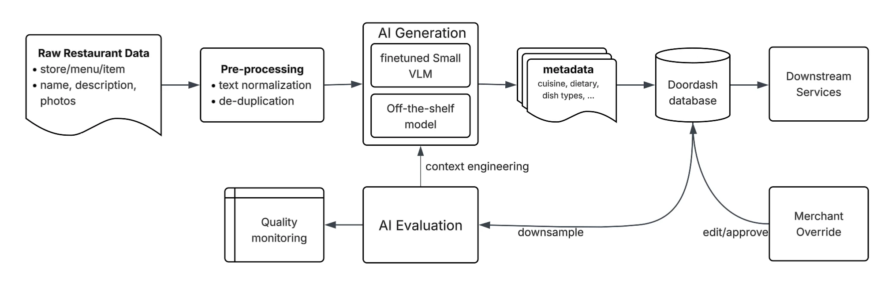
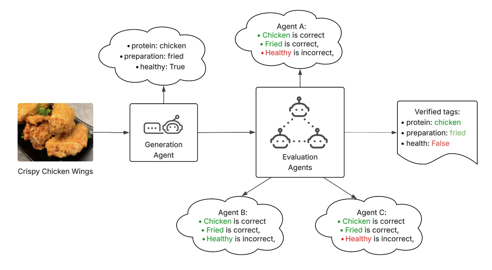
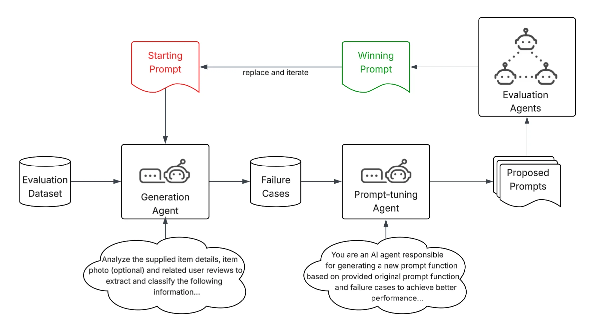
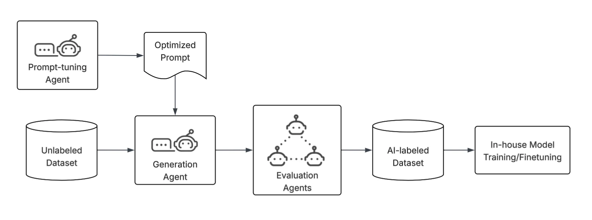
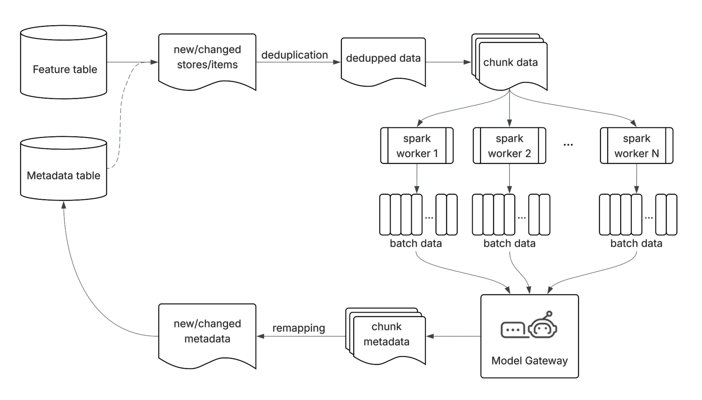

DoorDash serves a vast and diverse set of merchants, with every restaurant, menu, and dish expressed in its own unique way. A high-quality food catalog forms the backbone for customer search and the personalization experience, representing a key driver of restaurant success. Unlike standardized catalogs, food is deeply contextual, culturally rich, and highly non-standardized; the same dish can be described in countless ways, while entirely different dishes may share similar names, descriptions, or images.  Add to this that, at DoorDash’s scale, there are millions of unique items and constant menu updates. This variability and volume make it extremely challenging to generate reliable metadata via traditional approaches. 

To address this, we built an AI-led restaurant metadata platform. Our platform infers item- and store-level attributes — for example, whether an item is spicy, or that a restaurant’s cuisine is Chinese — using multimodal signals from text, images, and broad web searches. To build trustworthy, accurate metadata at scale, we engineered several key innovations within the complex DoorDash system, including: 

A large language model (LLM) jury system for high-quality evaluation, which increased the annotation accuracy by roughly 20% compared with typical human reviewers.
Context-optimization agents to iteratively improve prompts within minutes, increasing model precision by more than 20% while avoiding the inefficiency of handcrafted, suboptimal prompts. This loop accelerated prompt development tenfold.
Distributed computing enables high-volume LLM inference, cutting backfill time from over a month to just a few days, making it operationally viable to generate across millions of items.
AI-led annotation to generate training data, which unblocked fine-tuning to match frontier LLM quality at 10% of the inference cost, with zero human annotation effort.
This metadata platform allows us to successfully deploy generative AI reliably and cost-effectively at scale, improving our engineering workflow and the DoorDash consumer experience. 

High-level overview of the flow
As shown in Figure 1, our process begins with ingesting menu updates and deduplicating to minimize inference costs. We feed these items into AI generators to produce metadata, which undergoes immediate structural validation for error detection and retries. We continuously monitor the quality of generated predictions via an LLM jury; the evaluation result is also used for context engineering to improve the generation quality. Additionally, we provide a merchant override mechanism that allows business owners to validate or correct attributes.

Figure 1: This high-level overview of the DoorDash food metadata generation flow includes menu updates and deduplication through AI generation, evaluation, and merchant overrides.

Technical innovations
Traditional data collection, labeling, training, and evaluation are prohibitively slow and expensive, making it challenging to generate and extract high-quality metadata at the scale DoorDash requires. To address this, we developed a system that uses both multimodal language models and trained small language models (SLMs) to achieve high-quality, low-latency generation at a reasonable cost. Our carefully designed LLM Jury system enables reliable large-scale evaluation, continuous context optimization from real failure signals, and automated generation of high-quality labeled data to accelerate model improvement and in-house training.

Efficient and high-quality evaluations with LLM juries
Validating generated tags with human labeling is impractical in large-scale production. Only a small set of domain experts can apply tags in a way that matches how customers actually make ordering decisions and even fewer experts reliably understand the nuances across cuisines and menu language — for example, distinguishing Nepalese versus North Indian dishes, or interpreting whether “Sichuan-style” implies a heat profile. As a result, scaling human validation to encompass millions of items becomes prohibitively expensive and operationally impractical; traditional evaluation just won’t work for continuous, large-volume metadata generation.

Our automated LLM-based consensus evaluation system — LLM juries — replaces slow, costly, and inconsistent human validation. As shown in Figure 2, it includes the following steps:

Consensus LLM evaluation: Multiple strong LLM evaluators independently judge each proposed tag instead of relying on a single model or human labeler.
Voting and aggregation: Each evaluator provides a verdict and rationale; votes are aggregated into a single consensus decision.
Tag-level verification: Evaluators validate each tag individually — for example, protein, preparation, or health, individually rather than judging the item as a whole. Verified tags are saved and used in the database.

Figure 2: The LLM jury evaluation system uses multiple strong LLM evaluators to judge proposed tags independently. We aggregate votes and verify tags individually.

We found that the consensus LLM tags were about 20% more accurate than typical human-annotated labels. The success of our automated evaluation framework was foundational for automating the entire metadata generation system.

Reinforcement learning-inspired auto-context optimization 
Our system uses vision language models to improve the quality and efficiency of food metadata generation. While it can be easy to provide context to a prompt to generate some tags, generating highly accurate tags at scale is far more difficult and cannot be achieved in a single prompt. Even with highly skilled engineers, manual context engineering is slow, brittle, and unpredictable. Small wording changes that appear equivalent to humans can lead to very different model behavior, and handling edge cases requires repeated trial and error. As new item patterns and corner cases emerge, maintaining prompt quality becomes an ongoing unscalable manual effort.

Figure 3: The context optimization loop uses failure signals from high-quality evaluation datasets to propose and test prompt changes, iteratively improving model quality.

Inspired by reinforcement learning, we developed an autonomous loop, shown in Figure 3, that led to a tenfold increase in the speed of prompt context development. We define the task reward using the model’s performance on a high-quality evaluation dataset. A tuning agent identifies where the current prompt underperforms and uses these failure signals to propose better  context for the model. In every step, metrics are generated using a high-quality evaluation dataset. These act as our guardrails, ensuring the system always improves overall precision and recall. We optimize the prompt itself, rather than updating model weights, making the loop far faster and cheaper to run.

We chose this failure-signal-driven approach over population-based evolutionary methods, such as the GEPA algorithm, which maintain a population of candidate prompts and rely on mutation and crossover operators to explore the prompt space. Rather than blindly scoring many prompt variants per generation, our agent directly reads failure cases and proposes targeted rule changes. This makes each iteration purposeful rather than probabilistic and requires fewer evaluation rounds without requiring population hyperparameters that require tuning.

A few important lessons we would like to share:

Data quality is critical for this task: The evaluation dataset used to score prompt candidates directly determines the optimization direction. Low-quality or mislabeled examples cause the agent to chase noise rather than real signal, resulting in degraded or unstable prompts.
Failure cases carry more signal than successes: Through development, we tested different combinations of both failure and success cases. We found that weighting failure cases more heavily worked best for our use case.
Optimizing prompt mirrors optimizing model weights: Prompt optimization follows the same convergence dynamics as model training; an AI can complete in hours what a human would require days or weeks to do. 
This approach turns context engineering from an ad-hoc, human-driven task into a scalable, measurable optimization process that keeps pace with evolving data and use cases. We saw precision in our cases increase more than 20% in a hold-out evaluation set of data.

AI-led data annotation to accelerate training data collection
Metadata generation at DoorDash scale demands both accuracy and efficiency. Off-the-shelf LLMs are often either inaccurate or cost prohibitive; as a result, part of our AI system depends on highly specialized fine-tuned models. Training such models, however, requires annotations on thousands of tags across billions of catalog entities, which makes data labeling one of the biggest constraints in the development cycle. In a traditional workflow, producing that volume of training and evaluation data depends heavily on human annotation, making model iteration slow, expensive, and difficult to scale.

Figure 4: Our AI-powered annotation system uses dedicated generation and evaluation agents to efficiently create and validate high-quality labels for training specialized fine-tuned models.

To address this, we built an AI-powered data annotation system, shown in Figure 4, that generates and validates high-quality labels. We built a similar set of auto-context optimization, generation, and evaluation agents specifically to label tasks. Our small, fine-tuned models reduced inference costs by approximately 90% compared to LLMs, while achieving on-par performance.

LLM large-scale inference optimization
At DoorDash’s scale, millions of unique menu items, billions of menu options, and hundreds of thousands of daily updates require continuous metadata refresh. Relying on synchronous, per-item API calls for full backfills would take weeks, rendering daily updates impractical, while also driving up infrastructure and model costs. 

Figure 5: Our distributed LLM inference pipeline uses deduplication, Spark distribution, batch processing, and result remapping to transform large-scale generation from a slow bottleneck into an efficient, high-throughput process.

To address these challenges, we architected a distributed LLM inference pipeline, shown in Figure 5, to eliminate redundant compute and maximize throughput. Our approach relies on four key mechanisms:

Deduplication: Many merchants share identical item names and descriptions; naive processing would repeatedly send identical data to the model. We deduplicate using exact feature matches, avoiding redundant model calls.
Spark distribution: We chunk the remaining unique data and distribute it across a cluster of Spark workers for parallel processing.
Batch processing: We leverage batch LLM APIs to send grouped payloads to the model, maximizing throughput and cost efficiency. For trained models, we shard the data, which lets us re-run across many GPUs.
Result remapping: We map model outputs back to the original entities after processing to preserve data integrity.
Together, these optimizations transform large-scale metadata generation from a slow, costly bottleneck into a highly efficient, scalable, and cost-effective pipeline, reducing the backfill from over a month to just a few days.